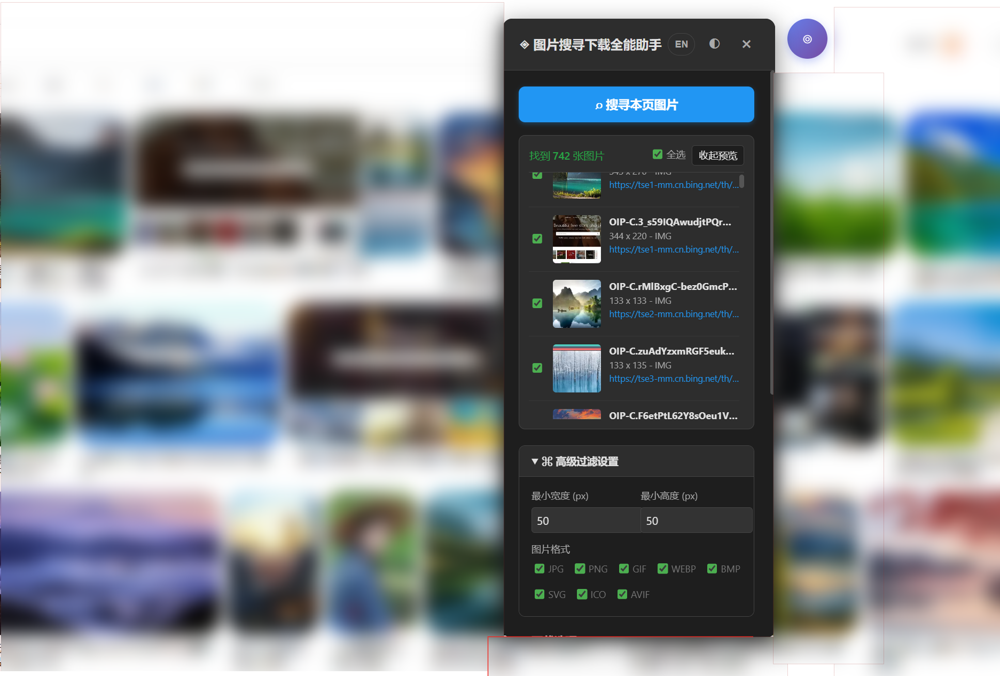
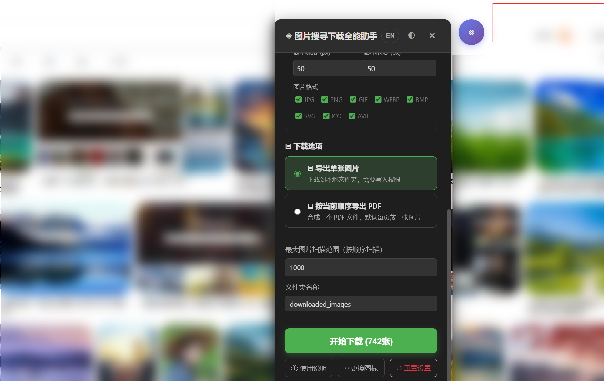
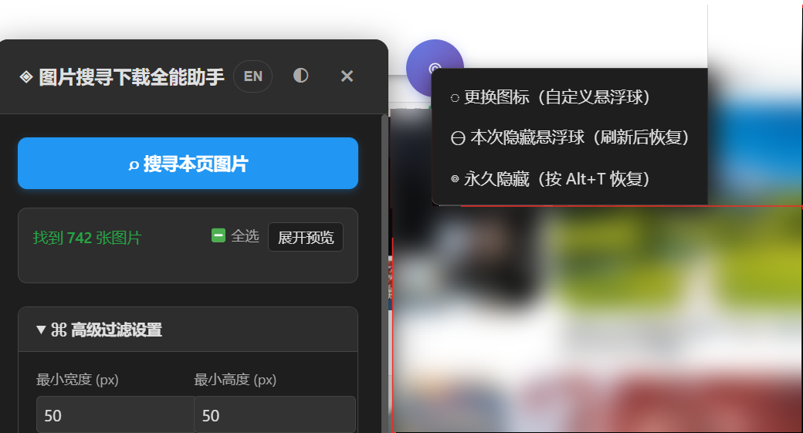
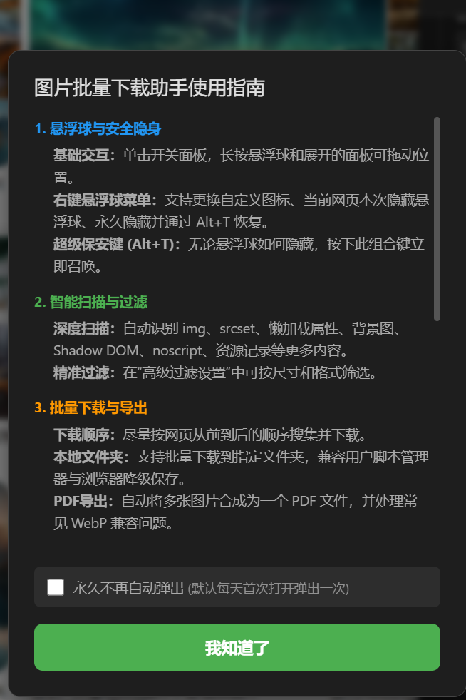

# 图片批量下载助手 / Image Download Helper

  

## 免责声明 / Disclaimer

### 中文

本工具**仅作学习交流、技术研究与个人效率提升使用**。请在明确知晓并遵守**当地法律法规**、目标网站服务条款及相关版权规则的前提下使用。

凡通过网络下载的内容，请于 **24 小时内自行删除**，不得传播、售卖、商用或用于任何侵犯他人权益的用途。使用本脚本产生的任何数据流向、存储行为及所有法律后果，在用户同意本协议时即视为其承认相关行为均由使用者自行承担。**作者**不对因使用本工具而导致的任何直接或间接损失负责。

### English

This tool is provided **for learning, technical research, and personal productivity only**. You must use it in compliance with **local laws and regulations**, the target website's terms of service, and all applicable copyright rules.

Any content downloaded from the internet should be **deleted by the user within 24 hours** and must not be redistributed, sold, used commercially, or used to infringe on the rights of others. By using this script, the user acknowledges that any data flow, storage behavior, and all legal consequences are solely the responsibility of the user. The **author** accepts no direct or indirect liability for any loss caused by the use of this tool.

---

## 中文说明

`图片批量下载助手` 是一个保持单文件 userscript 形态的网页图片嗅探与批量下载工具，优先兼容 ScriptCat、Tampermonkey、Violentmonkey，并为缺少部分 `GM_*` 能力的环境提供降级方案。

### 主要特性

- 更强的图片嗅探：
  支持 `img`、`currentSrc/src/srcset`、`picture/source[srcset]`、懒加载属性、背景图、`Shadow DOM`、`noscript`、资源记录、扩展名缺失的 CDN 图片线索等。
- 自动加载更全：
  扫描前会自动滚动页面与可滚动容器，并尝试触发常见“加载更多 / Load More”类按钮。
- 下载更稳：
  优先使用 `File System Access API` 选择目录；不可用时自动回退到 `GM_download` 或浏览器下载。
- 细节修正：
  修复扫描结果状态回写、下载按钮状态恢复、扩展名过滤统一、同名去重、文件名清洗等问题。
- 双语界面：
  面板、首次协议、使用指南均支持中文 / English 切换。
- 保留内置打赏图：
  安装后无需额外配置即可直接看到内置打赏二维码。

### 兼容环境

- ScriptCat
- Tampermonkey
- Violentmonkey
- 其他支持 JavaScript / userscript 的浏览器环境（按能力自动降级）

### 使用方式

1. 安装 [`图片批量下载助手.js`](./图片批量下载助手.js)
2. 打开任意网页
3. 点击悬浮球打开面板
4. 先执行图片搜寻，再按需下载单图或导出 PDF
5. 右键悬浮球可打开隐藏 / 更换图标等菜单
6. `Alt+T` 可恢复被隐藏的悬浮球

### 真实页面展示

---

## English

`Image Download Helper` is a single-file userscript for sniffing and batch-downloading webpage images. It is optimized for ScriptCat, Tampermonkey, and Violentmonkey first, with graceful fallback paths for environments that lack part of the `GM_*` API surface.

### Highlights

- Stronger image sniffing:
  scans `img`, `currentSrc/src/srcset`, `picture/source[srcset]`, lazy attributes, background images, `Shadow DOM`, `noscript`, resource entries, and extensionless CDN image hints.
- Better auto-loading:
  scrolls the page and scrollable containers before scanning, and tries common “load more” style triggers.
- More reliable downloads:
  prefers the `File System Access API`, then falls back to `GM_download`, then to browser-native download behavior.
- Code and behavior fixes:
  keeps scan state in sync, restores download button text correctly, unifies extension filters, deduplicates names, and sanitizes filenames.
- Bilingual UI:
  the panel, first-run agreement, and usage guide support both Chinese and English.
- Built-in donation QR:
  the donation image stays embedded and visible after installation.

### Supported Environments

- ScriptCat
- Tampermonkey
- Violentmonkey
- Other JavaScript / userscript-capable browser environments with automatic fallback

### Usage

1. Install [`图片批量下载助手.js`](./图片批量下载助手.js)
2. Open any webpage
3. Click the floating launcher to open the panel
4. Scan images first, then download single images or export a PDF
5. Right-click the launcher for icon / hide controls
6. Press `Alt+T` to restore the launcher when hidden

### Real Page Showcase

---

## 打赏二维码 / Donation QR

